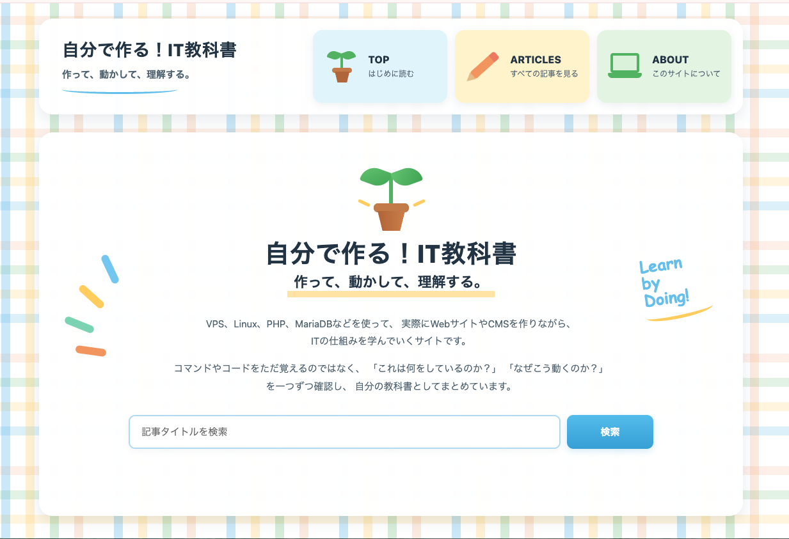
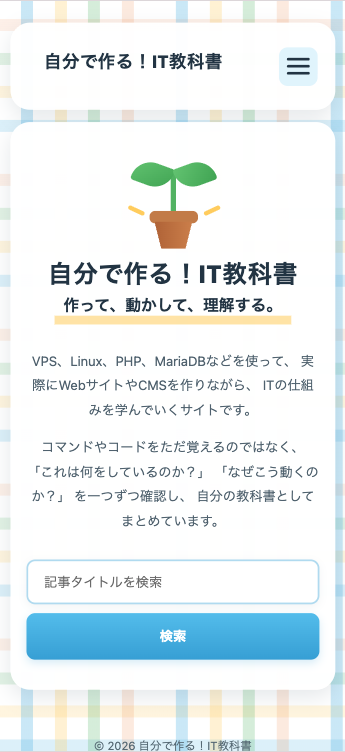
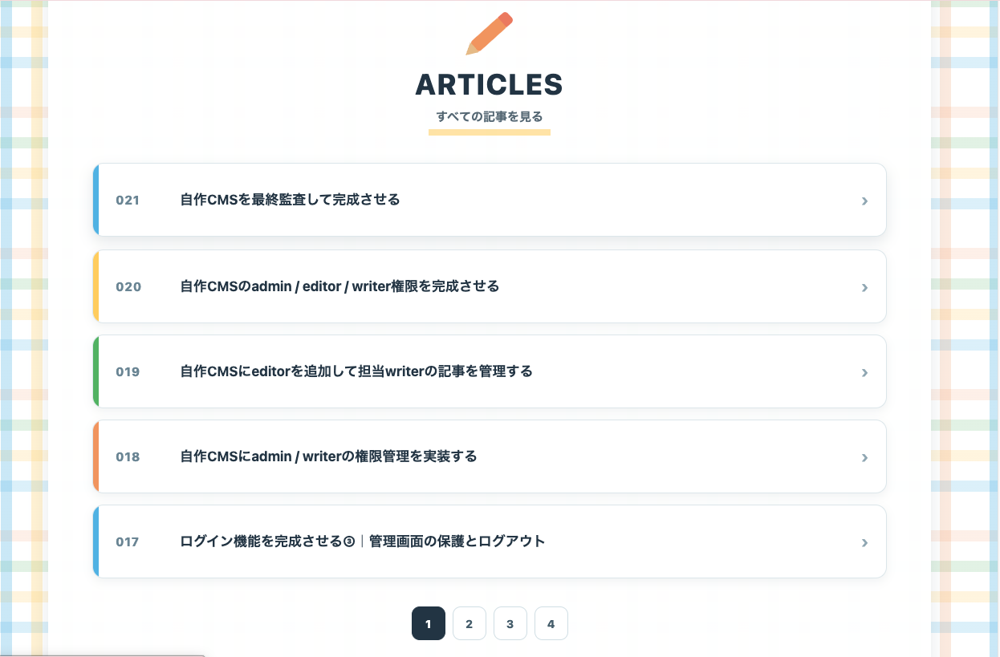
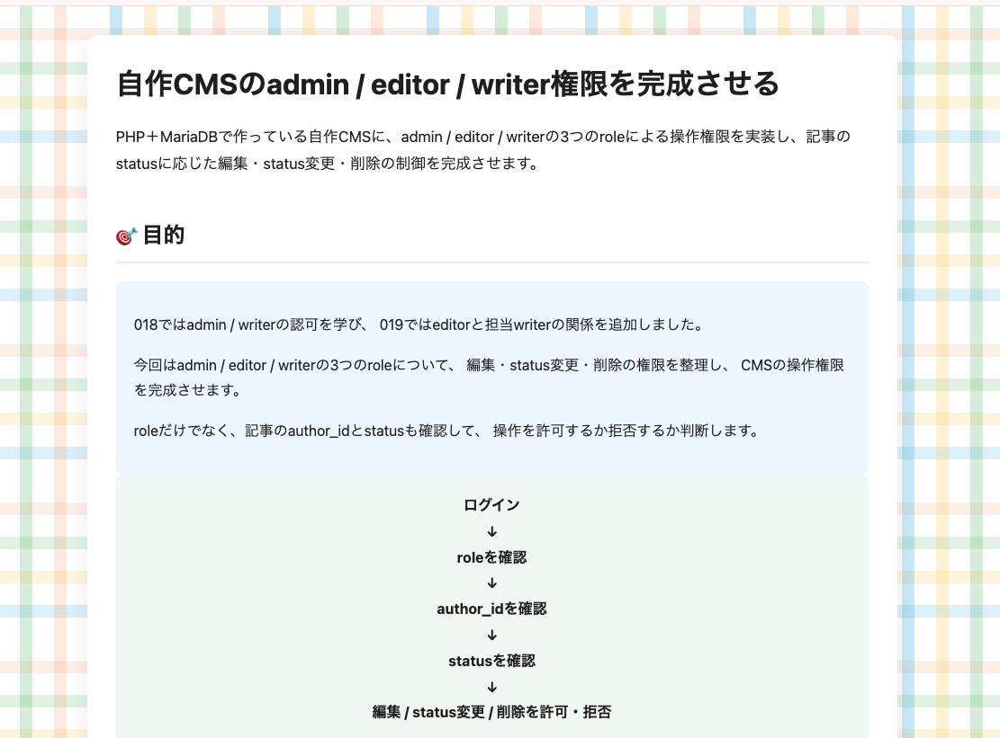
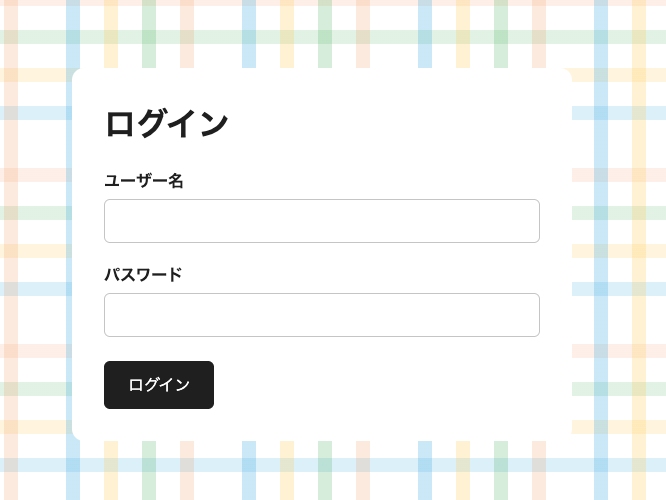

# 自分で作る！IT教科書

作って、動かして、理解する。

PHP・MariaDB・Linux・nginxを使って、
VPS上に自作CMSと学習サイトを構築しています。

---

## 特徴

- PHP + MariaDBによる自作CMS
- VPS上でのLinux / nginx環境構築
- 記事の作成・編集・公開管理
- タイトル検索
- 5記事ずつのページング
- 前後記事ナビゲーション
- ログイン認証
- CSRF対策
- PC / スマートフォン対応
- 共通CSSによるサイト構造の整理

---

## 概要

「自分で作る！IT教科書」は、
Webサイトを実際に作りながら、
Web開発の仕組みを理解していくための学習サイトです。

既存のサービスを利用するだけではなく、

Linux  
↓  
nginx  
↓  
PHP  
↓  
MariaDB  
↓  
HTML / CSS / JavaScript

という構成を、自分で構築しながら学習しています。

また、開発中に発生した問題や修正内容も
記事として記録しています。

---

## 技術へのこだわり

- Linux VPS上で環境を構築
- nginxをWebサーバーとして使用
- PHPによるCMS開発
- MariaDBによるデータ管理
- PDO / Prepared StatementによるDBアクセス
- password_hash() / password_verify()による認証
- CSRF対策
- レスポンシブ対応
- 共通CSSによる保守性の向上

---

## 主な機能

### 記事管理

- 記事作成
- 記事編集
- 記事公開
- 記事一覧
- 記事詳細

### 記事検索・一覧

- タイトル検索
- 5記事ずつ表示
- ページング
- 前へ / 次へ
- 前後記事ナビゲーション

### 認証

- ログイン
- セッション管理
- パスワードハッシュ
- CSRF対策

---

## スクリーンショット

### トップページ

<table>
  <tr>
    <td align="center"><strong>PC</strong></td>
    <td align="center"><strong>スマートフォン</strong></td>
  </tr>
  <tr>
    <td valign="top">
      
    </td>
    <td valign="top">
      
    </td>
  </tr>
</table>

### 記事一覧

### 記事詳細

### ログイン

---

## デモ

🔗 https://it-textbook.duckdns.org/index.php

---

## 開発記録

001〜の記事で、

- 実際に作ったもの
- 実装した機能
- 発生した問題
- 原因を調べた過程
- 修正方法
- そこから分かったこと

を記録しています。

「作って、動かして、理解する」を
開発そのものの記録として残しています。

---

## 開発の背景

Web開発の仕組みを、
既存サービスを利用するだけではなく、
自分で構築することで理解したいと考え、
VPS上に環境を作り始めました。

サイトそのものだけでなく、
データベース、認証、記事管理、検索、
レスポンシブ対応などを一つずつ実装しています。

---

## 今後の展望

- CMS機能の改善
- セキュリティ対策の強化
- UI / UXの改善
- 開発記事の追加
- VPS環境の保守・運用への理解を深める
